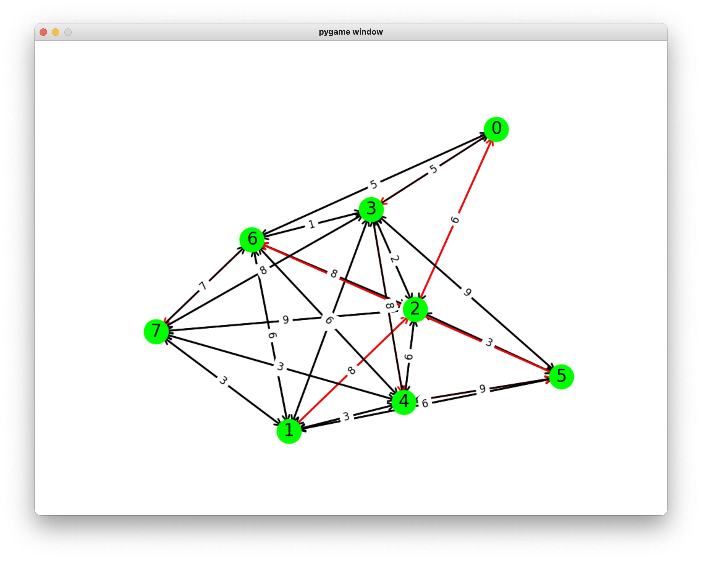

# Searching Project

- Made with Python
- This is a Project of **Introduction to Artificial Intelligence**
- Includes BFS, DFS, UCS, GREEDY, ASTAR algorithms

# Requirements

- Install [Python](https://www.python.org/downloads/)

# Deployment

- Open your terminal

```
% python main.py [input_file_path] [algorithm] [time_delay](optional)
```

**Note:**

- input_file_path: input.txt, SP6.txt
- algorithm: bfs, dfs, ucs, greedy, astar

# Overview

- GUI
  

Author: Nguyễn Thái Hiệp
